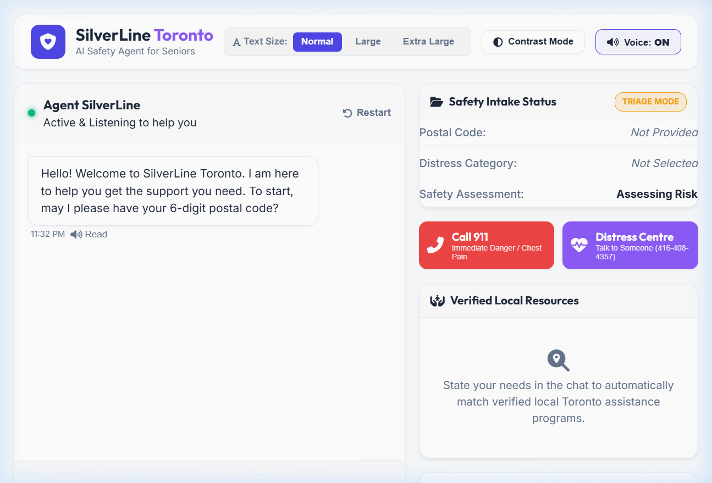
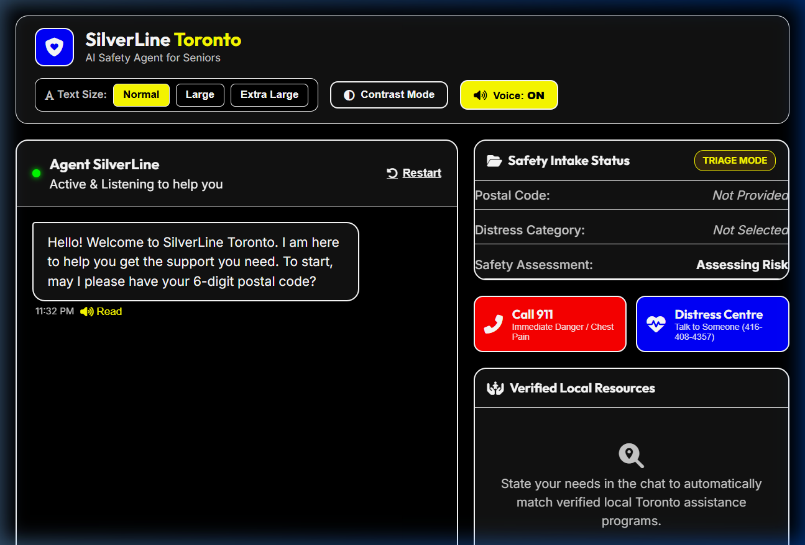
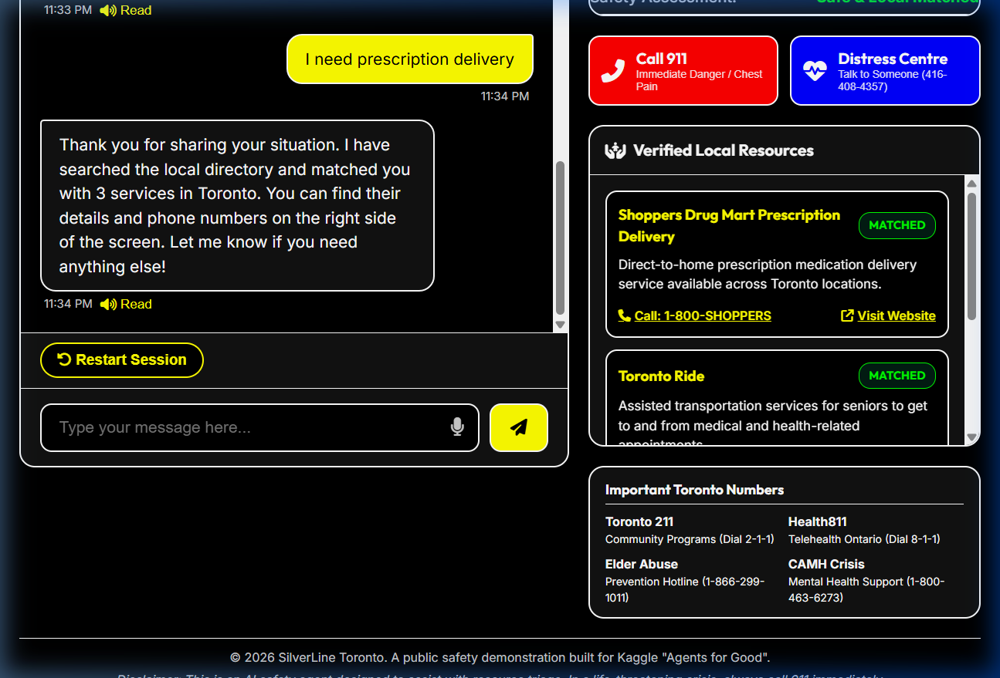
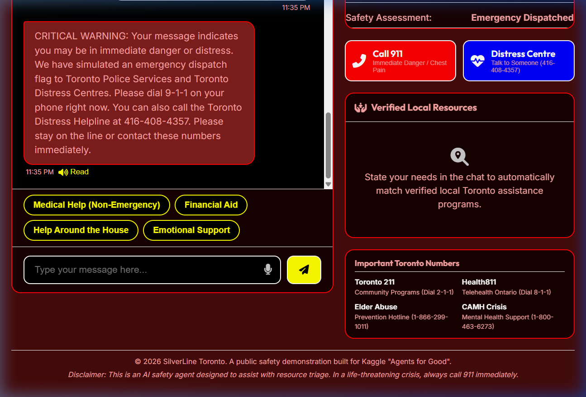
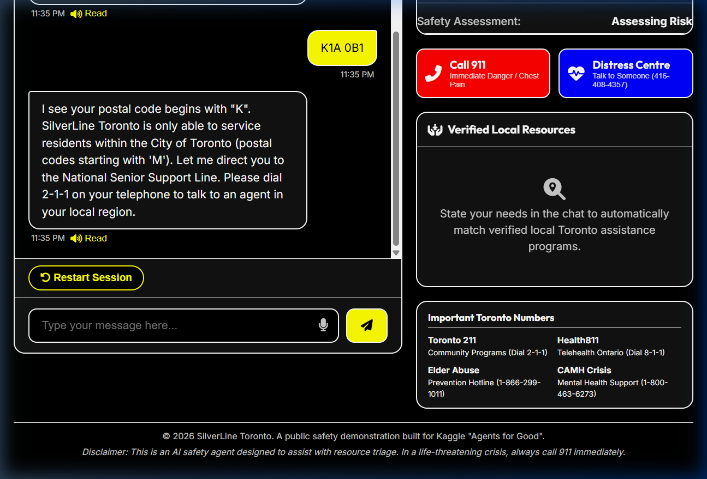
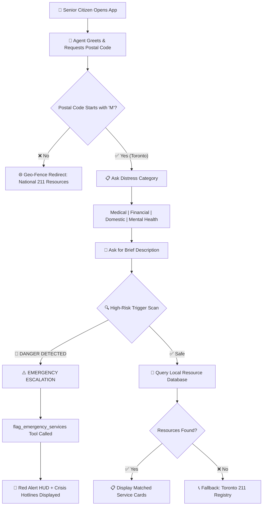

<p align="center">
  
  
  
  
</p>

<h1 align="center">🛡️ SilverLine Toronto</h1>
<h3 align="center">AI Safety Agent for Senior Citizens in Distress</h3>

<p align="center">
  <em>An empathetic, high-utility AI safety agent that connects Toronto seniors (65+) to verified local medical, financial, and domestic support services — in real time, with zero friction.</em>
</p>

---

## 📸 Live Demo Screenshots

### Welcome & Intake Screen
> The agent greets the user warmly and begins a structured, guided intake to gather essential information.



### High Contrast Accessibility Mode
> One-click toggle for seniors with visual impairments. All elements shift to a high-visibility black-and-yellow theme with bold borders and enlarged contrast ratios.



### Resource Matching — Medical Services Found
> After intake, the agent searches a verified local database and surfaces matched Toronto services with phone numbers and website links.



### 🚨 Emergency Triage Escalation (High-Risk Detection)
> When the agent detects life-threatening keywords (e.g., "chest pain", "self-harm"), it immediately halts normal flow, activates the emergency HUD, simulates a dispatch to Toronto Police/Distress Centres, and surfaces crisis hotlines.



### Geo-Fence Boundary Redirect
> If a user provides a postal code outside Toronto (not starting with 'M'), the agent politely explains its operational boundary and redirects to national resources (211).



---

## 🎯 Problem Statement

> Over **600,000 seniors** live in the Greater Toronto Area. Many face medical emergencies, financial hardships, or domestic isolation — and don't know where to turn for help.

SilverLine Toronto solves this by acting as a **single point of contact** that:
- Understands the senior's situation through gentle, guided conversation
- Detects life-threatening emergencies and escalates instantly
- Matches them to **verified, local Toronto services** — not generic Google results

---

## 🏗️ Architecture & Workflow



### Dual-Mode Architecture

| Mode | Trigger | Behavior |
|------|---------|----------|
| **🔶 Triage Mode** | Every new session | Guided intake: Postal Code → Category → Description. Validates Toronto geo-fence. Scans for high-risk keywords. |
| **🟢 Resource Mode** | Safe assessment passed | Searches local database of verified Toronto services. Returns matched cards with phone numbers and links. |
| **🔴 Emergency Mode** | High-risk trigger detected | Halts all input. Activates red alert HUD. Simulates emergency dispatch. Surfaces crisis hotlines (911, Distress Centre, CAMH). |

---

## ✨ Key Features

### 🧠 Intelligent Safety Triage
- **Postal Code Geo-Fencing**: Validates Canadian postal codes and restricts service to Toronto (codes starting with 'M')
- **High-Risk Keyword Detection**: Scans user input for phrases indicating self-harm, chest pain, physical abuse, structural collapse, unconsciousness, and other life-threatening scenarios
- **Emergency Escalation Protocol**: Simulates `flag_emergency_services` tool call, transforms UI to emergency state, and presents crisis hotlines prominently

### 🗄️ Verified Local Resource Database
Real Toronto services across four categories:

| Category | Sample Services |
|----------|----------------|
| **Medical** | Shoppers Drug Mart Prescription Delivery, Toronto Ride (medical transport), Toronto Public Health Dental |
| **Financial** | Toronto Rent Bank, Ontario Senior GAINS Program, Low-Income Energy Assistance (LEAP) |
| **Domestic** | WoodGreen Community Homemaking, Toronto Senior Services Home Maintenance, Sprint Senior Care |
| **Mental Health** | CAMH Geriatric Psychiatry Outreach, Toronto Distress Centres 24/7 Hotline |

### ♿ Senior-First Accessibility
- **Text Scaling**: Normal / Large / Extra Large font sizes via one-click toggle
- **High Contrast Mode**: Black background with bright yellow/white text for low-vision users
- **Voice Read-Aloud**: Every agent response is automatically spoken using the Web Speech API
- **Microphone Input**: Seniors can speak their responses instead of typing
- **Quick Reply Buttons**: Large, tappable category selection buttons reduce typing burden

### 📞 Emergency Quick Actions
- Persistent **Call 911** and **Distress Centre** buttons always visible in the sidebar
- Static reference panel showing Toronto 211, Health811, Elder Abuse Hotline, and CAMH Crisis numbers

---

## 📁 Project Structure

```
silverline-toronto/
├── public/                  # Frontend client files
│   ├── index.html           # Semantic HTML with accessibility features
│   ├── style.css            # Design system with themes and animations
│   └── app.js               # Agent logic, triage engine, resource matcher
├── docs/
│   └── images/              # Screenshots for documentation
├── server.js                # Express server (serves static files)
├── package.json             # Node.js dependencies and scripts
├── app.yaml                 # Google App Engine deployment config
├── Dockerfile               # Google Cloud Run container config
├── .gitignore               # Git ignore rules
└── README.md                # This file
```

---

## 🚀 Getting Started

### Prerequisites
- [Node.js](https://nodejs.org/) v20 or later
- [Google Cloud SDK](https://cloud.google.com/sdk) (for deployment only)

### Run Locally

```bash
# Clone the repository
git clone https://github.com/DevikaRaniP/silverline-toronto.git
cd silverline-toronto

# Install dependencies
npm install

# Start the server
npm start
```

Then open **http://localhost:8080** in your browser.

### Quick Test (No Server Needed)

You can also open `public/index.html` directly in any web browser to test the agent without installing anything.

---

## ☁️ Deploy to Google Cloud Platform

### Option A: Google App Engine

```bash
gcloud app deploy
gcloud app browse
```

### Option B: Google Cloud Run

```bash
gcloud run deploy silverline-toronto \
  --source . \
  --region us-central1 \
  --allow-unauthenticated
```

---

## 🧪 Test Scenarios

| # | Scenario | Input | Expected Result |
|---|----------|-------|-----------------|
| 1 | **Normal Medical Flow** | Postal: `M5V 2T6` → Medical → "prescription delivery" | Shoppers Drug Mart and Toronto Ride cards appear |
| 2 | **Emergency Chest Pain** | Postal: `M5V 2T6` → Medical → "severe chest pain" | 🔴 Emergency HUD activates, crisis hotlines shown |
| 3 | **Emergency Self-Harm** | Any valid postal → Any category → "I want to hurt myself" | 🔴 Emergency HUD activates immediately |
| 4 | **Out-of-Area Redirect** | Postal: `K1A 0B1` (Ottawa) | Agent explains Toronto boundary, suggests dial 211 |
| 5 | **Financial Support** | Postal: `M4B 1B3` → Financial → "can't pay rent" | Toronto Rent Bank and GAINS Program cards appear |
| 6 | **Domestic Help** | Postal: `M6K 3E3` → Domestic → "need grocery help" | Sprint Senior Care and WoodGreen cards appear |

---

## 🛡️ Guardrails & Safety Rules

- **Strict Geo-Fence**: Only serves Toronto postal codes (starting with 'M')
- **Zero Context Rot**: Agent stays focused on intake and resource delivery — no casual conversation
- **Fallback Strategy**: If no database match is found, always provides Toronto 211 central registry
- **Emergency Override**: Life-threatening triggers immediately halt normal flow and cannot be dismissed without restarting

---

## 🔧 Tech Stack

| Layer | Technology |
|-------|-----------|
| **Frontend** | HTML5, CSS3, Vanilla JavaScript |
| **Styling** | CSS Custom Properties, Glassmorphism, CSS Animations |
| **Typography** | Google Fonts (Inter, Outfit) |
| **Icons** | Font Awesome 6.4 |
| **Accessibility** | Web Speech API (TTS + STT), ARIA attributes, Skip links |
| **Backend** | Node.js + Express |
| **Deployment** | Google App Engine / Google Cloud Run |
| **Containerization** | Docker (node:20-alpine) |

---

## 🏆 Built For

<p align="center">
  <strong>Kaggle "Agents for Good" Competition Track</strong><br>
  <em>Building AI agents that make a tangible, positive impact on society.</em>
</p>

---

## 📜 License

This project is licensed under the MIT License.

---

## ⚠️ Disclaimer

> SilverLine Toronto is an **AI safety demonstration agent** built for the Kaggle competition. It simulates emergency dispatch and resource matching for educational purposes. **In a real life-threatening emergency, always call 911 immediately.**

---

<p align="center">
  Made with ❤️ for Toronto's seniors
</p>
